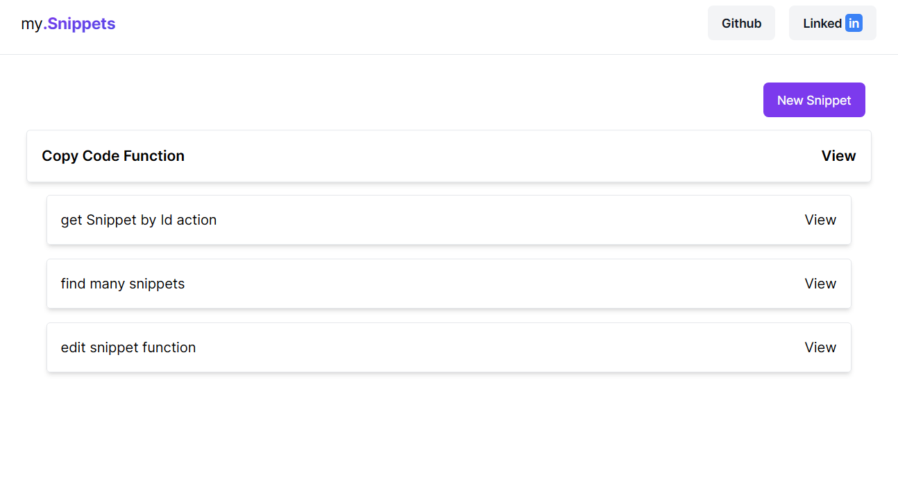

# My Snippets

The "My Snippets" is a web application designed to help developers organize and manage their frequently used code snippets. Whether you’re a seasoned programmer or just starting out, this app streamlines your workflow by providing a central place to store, retrieve, and share code snippets.


## Screenshot




## Tech Stack

**FrontEnd:** React, Next.js, Tailwind Css, Monaco Editor, Next Themes, Shadcn/ui

**Backend:** Prisma, Zod, Node


## Run Locally

Clone the project

```bash
  git clone https://github.com/renatorrocha/my-snippets
```

Go to the project directory

```bash
  cd my-snippets
```

Install dependencies

```bash
  npm install
```

Initialize Prisma types

```bash
  npx prisma generate
```

Apply all migrations

```bash
  npx prisma migrate deploy
```

Start the server

```bash
  npm run dev
```

